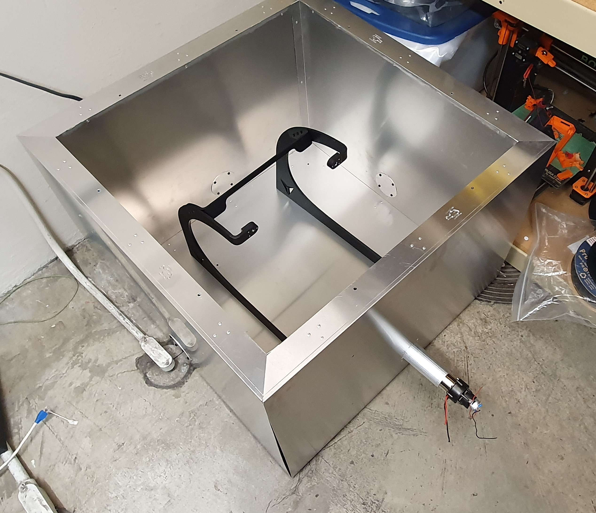
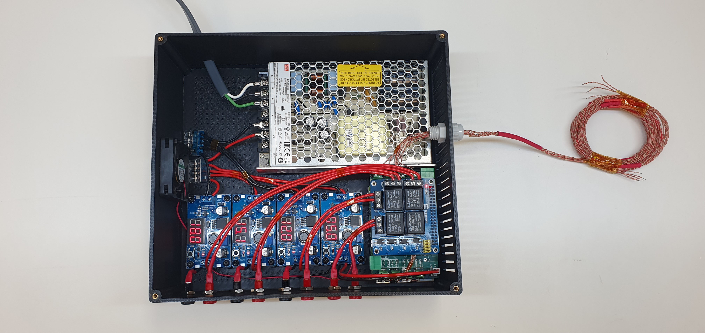
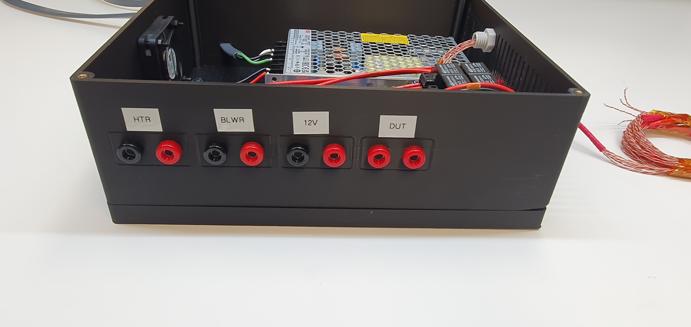

# Thermal Chamber (Test Setup)

> **Scope:** This repo contains the firmware, CAD, and electrical files to build a small benchtop thermal chamber for testing the VoxVisoion camera system. This repo, while intended for internal use, was made public to allow for the use of the designs by hobbyists. Voxelis AI makes no claims of functionality or saftey and will not maintain this repo.
>
>  This README covers: system overview (mechanical & electrical), firmware behavior, setup, and usage.

---

## 1) System Overview

### Mechanical

* **Body:** Bent aluminum sheet enclosure, filled with **fire-safe spray foam** for thermal insulation.
* **Heater:** Heating element harvested from a **DeWALT DCE530B** hot air gun ("heat gun"), integrated as the primary heat source.
* **Lid & Stand:** Removable lid and a fully aluminum stand for DUT staging during tests.
* **Wire gantries:** Three gantries provide tidy cable routing for power/sensors with bolted covers.

> Mechanical Enclosure Without Lid:
>
> 

### Electrical

* **Controller:** Raspberry Pi 4B.
* **Relays (x4):** PiRelay V2 board controls:

  * **RELAY1 → DUT Control** (logic/enable)
  * **RELAY2 → DUT Power** (primary supply to DUT)
  * **RELAY3 → Blower** (fan)
  * **RELAY4 → Heater** (heat gun element)
* **Sensing:** 8× **K‑type thermocouples** via Sequent Microsystems Thermocouple DAQ Shield.
* **Power Architecture:** Single **34 V** main PSU feeds four DC/DC regulators creating **18 V**, **15 V**, **12 V**, and **5 V** rails.
* **Packaging:** Electronics live in a 3D‑printed case with an exhaust fan and labeled banana jacks for external connections.

> Electrical Encluosure Without Lid:
>
> 

> Electrical Encluosure Ports:
>
> 

> System Diagram:
>
> 

---

## 2) Firmware Overview

Two key Python modules power the chamber control loop:

### Relay Driver (`PiRelay.py`)

* Thin wrapper for the PiRelay V2 board using **RPi.GPIO**.
* Exposes a `Relay` class with `on()`/`off()` and a fixed pin map for `RELAY1..4`.

### Chamber Control (`RunChamber.py`)

* **Startup behavior**

  * Creates a **durable CSV log** under `~/chamber_logs` with local (Vancouver) timestamps.
  * Checks it’s running under a persistent context (**tmux/screen/nohup/systemd**). If not, it exits to protect data integrity.
  * Prompts for **thermocouple type** (defaults to **K**) and **setpoint temperature**.
  * Prompts for **DUT max temperature** (must be ≥ setpoint + 20 °C) for safety.
  * Waits for user confirmation to **power the DUT** and **start the test**.

* **I/O assignments** (via relays)

  * `RELAY1` → **DUT Control** (`rlyDutCtrl`)
  * `RELAY2` → **DUT Power** (`rlyDutPwr`)
  * `RELAY3` → **Blower** (`rlyBlower`)
  * `RELAY4` → **Heater** (`rlyHeater`)

* **Thermocouple channel roles** (via DAQ shield)

  * `tc1`: Ambient sensor
  * `tc2`: Ambient sensor
  * `tc3`: Ambient (hot side mounted near exhaust)
  * `tc4`: **Heater** sensor (monitoring for safe operation)
  * `tc5`: **DUT safety** sensor (trip limit)
  * `tc6..8`: **Data** sensors (user‑positioned)

* **Control Loop**

  * Weighted chamber temperature = `((2×tc1) + (2×tc2) + tc3) / 5`.
  * **PID** controller (`simple_pid`) drives a **windowed PWM** (5 s window) for heater/blower: relay ON for `control` seconds, then OFF for the remainder of the 5 s.
  * **Safety trips:**

    * If `tc5` (DUT) > *DUT max*, shutdown.
    * If `tc4` (heater) > 200 °C, shutdown.
    * If computed chamber temp > 200 °C, shutdown.
  * **Logging:** Every loop writes CSV with `Timestamp, ChamberTemp, SetTemp, ControlOutput, TC1..TC8` (fsync for durability).
  * **Live Plot:** If running with a display (not headless/tmux‑detached), shows a Matplotlib plot of chamber temperature vs. time with the setpoint overlay.

* **Shutdown paths**

  * On normal exit, safety trip, or `Ctrl+C`, all relays are turned **OFF**, CSV is flushed/closed, and GPIO is cleaned up.

---

## 3) Bill of Software (Packages)

> The chamber runs on **Raspberry Pi OS**. Install system deps, then Python packages.

### System packages (APT)

```bash
sudo apt update
sudo apt install -y python3 python3-pip python3-venv \
  python3-dev libatlas-base-dev \
  tmux git
```

### Python packages (pip)

> Recommended: use a venv on the Pi.

```bash
python3 -m venv ~/venvs/chamber
source ~/venvs/chamber/bin/activate
pip install --upgrade pip
pip install RPi.GPIO pytz matplotlib simple-pid
```

### Hardware vendor libraries

* **Thermocouple DAQ Shield** Python module: `sm_tc`.

  * Install using Sequent Microsystems’ instructions (their repo/package for the thermocouple HAT/DAQ).
```
sudo pip install SMtc
```
* **PiRelay V2** uses the included `PiRelay.py` driver in this repo (no extra install required).

> **Note:** If Matplotlib GUI backends complain in tmux/headless, the firmware auto‑selects the **Agg** backend; plotting is disabled when detached.

---

## 4) Hardware Setup (Summary)

1. **Assemble enclosure:** Aluminum body + fire‑safe foam; mount heater element and blower.
2. **Mount electronics:** Raspberry Pi 4B + PiRelay V2 + Thermocouple DAQ Shield; 3D‑printed case with cooling fan.
3. **Wire power:** 34 V PSU → DC/DC regulators → 18 V/15 V/12 V/5 V rails. Route rails to DUT and auxiliaries through **banana jacks** as labeled.
4. **Relay outputs:**

   * RELAY4 → Heater element
   * RELAY3 → Blower fan
   * RELAY2 → DUT power (through appropriate fuse)
   * RELAY1 → DUT control/enable (logic‑level interlock)
5. **Sensors:** Place 8× K‑type probes (see channel roles above). Ensure DUT‑max probe (tc5) is on the DUT’s most temperature‑sensitive part.
6. **Thermal safety:** Verify airflow, install fuses, confirm relay default‑OFF, test emergency stop procedure (power kill).

---

## 5) Running the Chamber

### With tmux (required)

```bash
# Start/attach a session
tmux new -s chamber

# In the session, activate venv and run
cd ~/scripts
sudo --preserve-env=TMUX,STY python3 RunChamber.py
```

**Prompts you will see:**

* Thermocouple type `[B,E,J,K,N,R,S,T]` (defaults to K)
* Desired chamber temperature (°C)
* DUT maximum temperature (°C ≥ setpoint + 20)
* Confirmations to power DUT and to start test

**Outputs you will get:**

* Console line each loop:

  ```
  Chamber Temp: <curr> C, Set Temp: <set> C, DATA1: <t6> C, DATA2: <t7> C, DATA3: <t8> C, Control Output: <sec>
  ```
* **CSV logs** saved to `~/chamber_logs/TC_DATA_EVENT:_<HH:MM:SS>_<YYYY-MM-DD>.csv` (safe‑flushed for durability).
* **Live graph** if a display is present (disabled when headless/detached).

**Stop the test:**

* Press `Ctrl+C` or close the tmux pane. The program shuts down heater/blower/DUT and closes the log.

---

## 6) Notes & Safety

* Relays default **OFF** at boot; the program explicitly de‑energizes them before starting.
* Always verify **DUT max** is sufficiently above **setpoint** to avoid nuisance trips.
* Do **not** leave the chamber unattended. Keep a fire extinguisher nearby.
* Ensure proper **fusing**, wire gauges, crimp quality, and insulation on all mains/DC lines.
* Chamber walls get **increadibly hot**.

---

## 7) Troubleshooting

* **“Process is not persistent” exit:** Run inside **tmux** (or `screen`/`nohup`/`systemd`).
* **No plot in tmux/headless:** Expected; plotting is disabled when no display.
* **CSV files not appearing:** Check `~/chamber_logs` path and write permissions.
* **Heater/Blower always OFF:** Confirm relay wiring, GPIO pin map, and that the PiRelay V2 board is seated.
* **DAQ read errors:** Re-seat the DAQ shield, verify I²C/SPI (per vendor), confirm thermocouple types match your probes.
* **Pi appears dead in port scanner** Power the Pi on and off using the 5V cable inside the box. For some unkown reason this has a better success rate than just unplugging it (assuming paracitic voltages from PS caps)

---

## 8) License & Attribution

* © 2025 Voxelis AI.
* Written by Christopher Pederson
